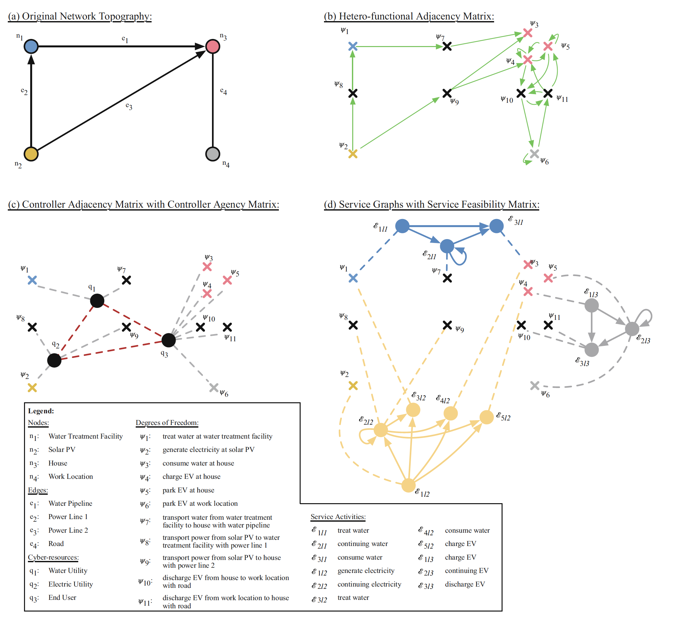

# Hetero-Functional Graph Theory Toolbox
The Hetero-Functional Graph Theory (HFGT) is a rigorous modeling platform that can model the structure and function of highly interconnected
and heterogeneous engineering systems seen in systems-of-systems. A detailed explaination of the theory and the underlying mathematics can be found in the book [A Hetero-functional Graph Theory for Modeling Interdependent Smart City Infrastructure](https://www.springer.com/gp/book/9783319993003). This toolbox facilitates the instantiation of the seven mathematical models of the HFGT from a single XML input file.

This recently developed _Hetero-functional Graph Theory Toolbox_ facilitates the computation of HFGT mathematical models including the hetero-functional adjacency matrix, hetero-functional incidence tensors and the associated knowledge basis.  It is written in the programming language python version 3.9 and when handling large computation is ported to the language Julia. It is openly available on GitHub with sample input files for straightforward re-use.

A paper that serves as a user guide on how to use this toolbox has currently been submitted to Scientific Reports and is currently under review. If and when accepted, it shall be uploaded to this repository for further clarity. 

The toolbox contains two principal modules: XML2LFES() and raw2FullLFES() that are executed in sequence. In brief, the XML2LFES() module serves to import the input XML file and create the myLFES data structure in a “raw"
structure. Then, the raw2Full() module makes the HFGT calculations necessary to convert the myLFES data structure to the “full" state.


The input XML file - "Example_Network.xml" provided in this repository depicts a simplistic 4-Node Smart City Network. The topology of this example network and some of the associated graphs of the HFGT mathematical models are presented below. An input XML file for any engineering system can be generated along the same lines and the engineering system's HFGT models can be computed using this toolbox.



## Quickstart
To install as a package, run the following command:

``` poetry add git@github.com:LIINES/HFGTToolbox.git#master ```

TODO: publish this package somewhere that allows installation via pip this (eg Pypi, public github etc).

## Installation

To just install this package into an existing environment Follow these steps:

1) run:
	```shell
	poetry add pyproject.toml
	```
2) Install Julia into existing environment's path:
	- Install Julia into your current working environment (https://julialang.org/downloads/). 
	- Once Julia is installed install the following packages to your Julia install using the following commands in a Julia shell:
	```Julia shell
	using Pkg
	Pkg.add("CSV")
	Pkg.add("DataFrames")
	```

## Setup
To develop using this source code, follow these steps:

To get started quickly, install a few prerequisites:
- [Git](https://gitforwindows.org) (latest version)
- [Poetry](https://python-poetry.org/docs/#installation) (1.1.13 recommended, avoid 1.2.0 for now.)
- [Pyenv](https://github.com/pyenv/pyenv) (Linux/Mac) or [Pyenv-win](https://github.com/pyenv-win/pyenv-win) (Windows) for installing/activating multiple python versions

```shell
# We recommend using `pyenv` to manage multiple python versions. If pyenv is installed, just run:
cd HFGTToolbox
cd Python-HFGT-Toolbox
pyenv install 3.9.13
pyenv shell 3.9.13
poetry install # install all dependencies (direct and transitive) listed in project.toml
poetry shell # activate virtual environment
scripts\test # (Windows) run unit tests
scripts/test # (Mac/Linux) run unit tests
python src/python_hfgt_toolbox/PyHFGTToolbox_Analysis.py "data/XMLs/Example_Network.xml" 0 # Analyze an example network
```

## Usage
The HFGT toolbox repository contains the following directories:
1) XML2LFES
	The XML2LFES repository has the following subfolders:
	a) XML2LFES_classes
		Sets up the LFES class structure
	b) XML2LFES_functions
		Functions that help read the XML file and convert it to the LFES class structure.
2)raw2FullLFES
	The raw2Full repository has the following subfolders:
	a) raw2FullLFES_functions
		Functions that perform the HFGT analysis.

The PyHFGTToolbox_Analysis.inpyb file shows how to use the toolbox. Additionally, the toolbox repository contains four sample input XML files:
I) Example_Network.xml - The example network from Chapter 4 of the HFGT book.
II) Example_Network_DOFs_Idx.xml - The example network from Chapter 4 of the HFGT book in the DOF index based format for running the Julia verboseMode (3).
III) AMES_NY_Elec_NG_Oil_Coal.xml - The AMES HFGT compliant XML of the American Multimodal Energy System's region of NY.
IV) AMES_NY_Elec_NG_Oil_Coal.xml - The AMES HFGT compliant XML of the American Multimodal Energy System's region of NY in the DOF index based format to running the Julia verboseMode(3).

NOTE : The assignment of values to parameters in the LFES class structure happens within the functions.

Also NOTE : This version of the toolbox is work in progress. 
********************************************************************************
********************************************************************************
The service feasibility matrices might still be incorrect as in the book. Need to upgrade to V-10 trimetrica to test and might need to change the usage of the map function in the service matrices to regex.
********************************************************************************
